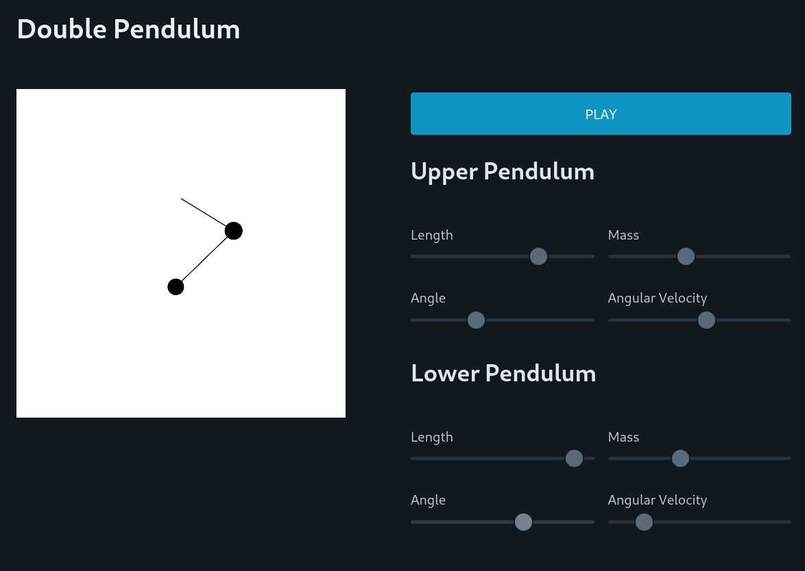

# Double Pendulum
## A Physics simulation - written in Go and presented using Svelte (using Picocss)

#### Running the Project

To run this project, run `go mod tidy` in your terminal, followed by `go run .`. There should be a log message directing you to a locally hosted webpage (i.e. at the IP address 127.0.0.1). Open this webpage and play around!

#### Making Changes

Making changes to the simulation code is simple - just change the `pendulum/pendulum.go` file!

To change the web front end is a little more tricky. Since we are using Go as the router, we need to compile the Svelte code to a static App before pointing the Go router to this directory. Once you have made changes to the Svelte code (under `web/src`), you can compile the front end by navigating to the web directory and running `npm install` followed by `npm run build`. On subsequent builds you can just run `npm run build`.